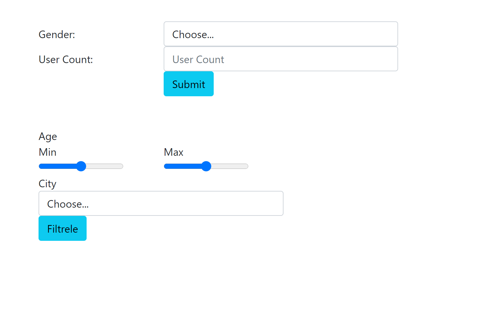
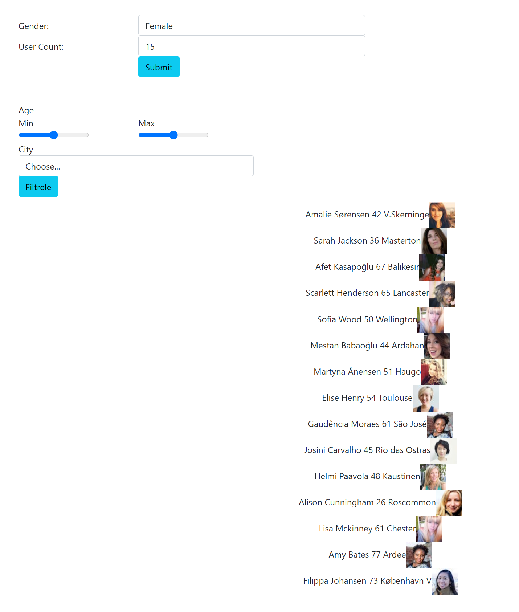
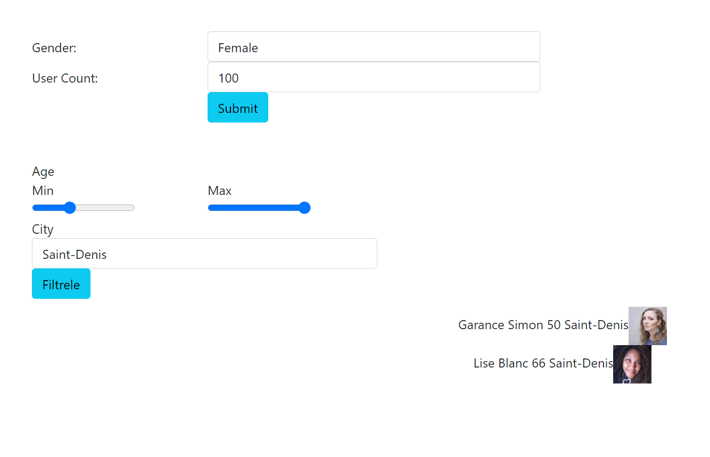

# Random User Web Application
## Introduction
In this application, the users that are fetched from ["randomuser api"](https://randomuser.me/api) can be listed. Listed users can be filtered according to "age" and "city" with the filter mechanism on the screen.

## Initial Screen

## Submit Screen

## Filter Screen
